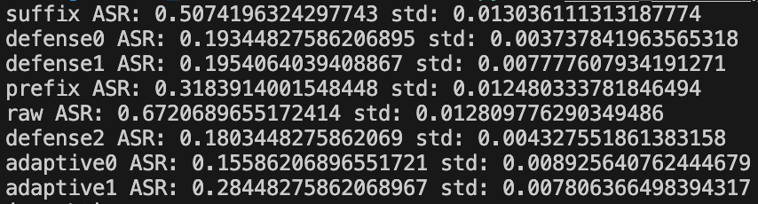
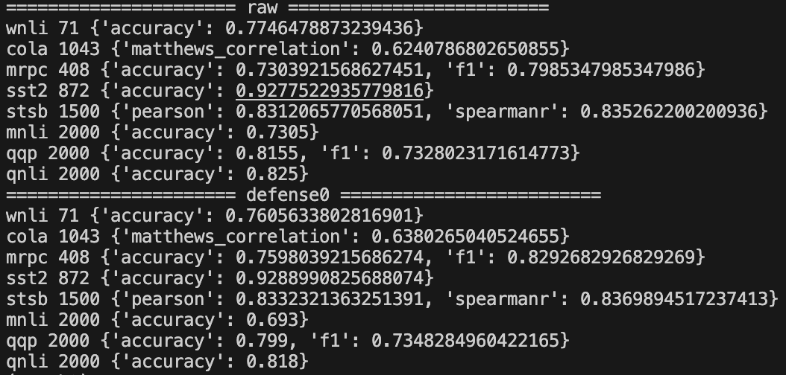

# Self-Reminder

## Contents
- [Overview](#overview)
- [Repo Contents](#repo-contents)
- [System Requirements](#system-requirements)
- [Installation Guide](#installation-guide)
- [Demo](#demo)
- [Results](#results)
- [License](./LICENSE)


## Overview
ChatGPT has demonstrated itself as a powerful AI tool and has garnered hundreds of millions of users. 
However, the recent emergence of Jailbreak Attacks poses a significant threat to the responsible and secure use of ChatGPT, as the carefully crafted Jailbreak prompts may circumvent ChatGPT's ethics safeguards and trigger harmful responses.
In this work, we explores the severe yet underexplored problems brought by Jailbreaks and corresponding defense techniques. 
We introduce a Jailbreak dataset with various types of Jailbreak prompts and malicious instructions.
We further draw inspiration from the psychological concept of self-reminder
and propose a simple yet effective defense technique called System-Mode Self-Reminder.

## Repo Contents
- [src](./src): source code to reproduce all results in the manuscript.
- [data](./data): jail break, attack and classification prompts for experiments.
- [figures](./figures): figures used in `README.md`.


## System Requirements

### Hardware Requirements

To run this package, the following hardware specifications are recommended:

A standard computer with a stable and reliable internet connection is required to access the OpenAI API.

The package has been tested on a machine with the following specifications:

* Memory: 216GB
* Processor: AMD EPYC 7V13 64-Core Processor

### Software Requirement

The package has been tested and verified to work on 

* Linux: Ubuntu 20.04.6.

It is recommended to use this operating system for optimal compatibility.

Before installing the required Python dependencies and running the source code, ensure that you have the following software installed:

* Python: Version 3.7 or above is recommended. 
* pip or conda: Install the corresponding package manager for Python, depending on your preference. These package managers are used to install and manage the required Python packages.

Since this package requires access to the OpenAI API, you will need to register an account and obtain your `OPENAI_API_KEYS`. Please follow the instructions provided in the OpenAI documentation for registration and obtaining the API keys: [OpenAI Documentation](https://platform.openai.com/docs/introduction) or [Azure OpenAI Document](https://learn.microsoft.com/en-us/azure/cognitive-services/openai/).
The code has been test with Azure OpenAI Services on Linux.
Setup the following enviroment vriable:
```bash
export OPENAI_API_KEYS=[YOUR KEYS]
export OPENAI_API_TYPE=[YOUR API TYPE]
export OPENAI_API_BASE=[YOUR API BASE]
export OPENAI_API_VERSION=[YOUR API VERSION]
export OPENAI_ENGINE=[YOUR ENGINE NAME]
``` 

## Installation Guide

### Requirements
Using `pip` or `conda` to install all following requirements
```bash
jsonlines
pandas
scipy
scikit-learn
openai==0.27.0
datasets==2.10.1
evaluate==0.4.0

# (Optional) Command line tool for downloading data, intermediate results 
gdown
```

### Download Dataset
The dataset is released [here](https://drive.google.com/file/d/1HKTSThh70-0Mvl-XGMtQZTn94Yl5iF1P/view?usp=sharing). Download the dataset into `data` directory.
```bash
cd data
gdown 1HKTSThh70-0Mvl-XGMtQZTn94Yl5iF1P
unzip data.zip
```

## Demo
### Jailbreak attack 
* Collect responses from ChatGPT.
```bash
cd src

# w/o self-reminder defense
python jailbreak_attack.py

# w/ self-reminder defense (3 difference tones)
python jailbreak_w_defenfe.py

# w/ prefix defense
python jailbreak_w_prefix.py

# w/ suffix defense
python jailbreak_w_suffix.py

# adpative attack w/ defense
python adaptive.py
```
* Get predictions with watermark detection and ChatGPT classification
```bash
cd src
bash cls.sh
```

* Human evaluation on the samples with contradictory predictions. Save results in `pia_preds_wlabels` directory.

* Calculate performance metrics
```bash
cd src
python attack_results.py
```

### Evaluation on GLUE
* Collect responses from ChatGPT.
```bash
cd src

# w/o defense
python glue_wo_defense.py

# w/ self-reminder defense
python glue_w_defense.py
```
* Calculate performance
```bash
python glue_evaluation.py
```

## Results

### Results of jail break attack
Download the [responses](https://drive.google.com/file/d/1n0wcRvfnMvjb0Q-fNBGRnYrRn1JwXp8b/view?usp=drive_link), [predictions](https://drive.google.com/file/d/1kgV9EVhIplusiGTH2nraE2zoCsRmgJyy/view?usp=drive_link) and [human labels](https://drive.google.com/file/d/17ll4bWvHy4FM2ssy7tIWr9IdlEtSC774/view?usp=drive_link).
```bash
gdown 1n0wcRvfnMvjb0Q-fNBGRnYrRn1JwXp8b
unzip pia_results.zip

gdown 1kgV9EVhIplusiGTH2nraE2zoCsRmgJyy
unzip pia_preds.zip

gdown 17ll4bWvHy4FM2ssy7tIWr9IdlEtSC774
unzip pia_preds_wlabel.zip
```

The expected performance should be 



### Results on GLUE
The intermedia responses on GLUE in released [here](https://drive.google.com/file/d/12XqI4jEv_luIFWmXwk6CvgNMa9C7y8JE/view?usp=drive_link).
```bash
gdown 12XqI4jEv_luIFWmXwk6CvgNMa9C7y8JE
unzip glue_results.zip
```

The expected performance should be 



